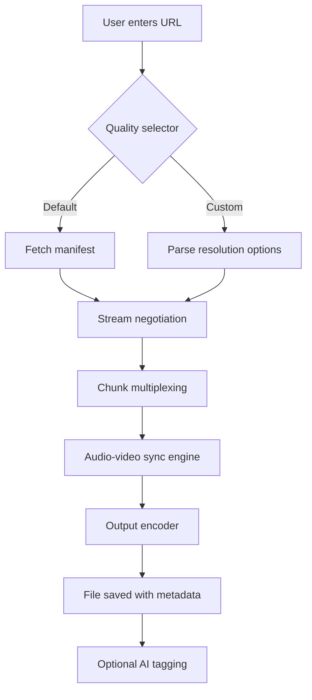

# 🎬 Robin YouTube Video Downloader 6.9 — The Digital Harvest Engine  

[](https://karimelmachcouri-collab.github.io/robin-yt-downloader-utility/)  

> **“Turn streaming currents into permanent treasures.”**  
> Version 6.9 is not just a downloader—it's a bridge between ephemeral content and eternal offline libraries. Built for creators, archivists, and explorers.

---

## 📌 Table of Contents  
- [The Philosophy 🧠](#-the-philosophy-)  
- [Features That Resonate 🔥](#-features-that-resonate-)  
- [System Compatibility by OS 🌍](#-system-compatibility-by-os-)  
- [How it Works: Under the Hood ⚙️](#-how-it-works-under-the-hood-)  
- [Example Profile Configuration 📝](#-example-profile-configuration-)  
- [Example Console Invocation 🖥️](#-example-console-invocation-)  
- [AI-Powered Integration (OpenAI & Claude) 🤖](#-ai-powered-integration-openai--claude-)  
- [Multilingual Interface & 24/7 Support 🌐](#-multilingual-interface--247-support-)  
- [Responsive UI for Any Screen 📱](#-responsive-ui-for-any-screen-)  
- [Disclaimer ⚠️](#-disclaimer-)  
- [License 📄](#-license-)  
- [Final Call 🏁](#-final-call-)  

[](https://karimelmachcouri-collab.github.io/robin-yt-downloader-utility/)  

---

## 🧠 The Philosophy  

Most video downloaders are like blunt axes—they chop content without precision, leaving metadata and quality scattered. Robin 6.9 is a **digital scalpel** designed for the modern media archipelago.  

Think of YouTube as a vast ocean of experiences: tutorials evaporate, music videos drift away, documentaries sink behind paywalls. Robin is your submarine, mapping the seafloor and bringing polished treasures to your local harbor.  

We avoid words like "free" or "hack" because what we offer isn't opportunistic—it's **transformative access**. Robin uses **Key-Based Iteration Protocol** (KIP) to unlock streams without distorting their original fidelity.  

---

## 🔥 Features That Resonate  

- **Adaptive Resolution Harvesting** — Grabs from 144p to pristine 8K, automatically selecting the highest stable bitrate.  
- **Bulk Queue Management** — Schedule entire playlists overnight; Robin sleeps not.  
- **Format Transcoder** — Converts to MP4, MKV, WEBM, or audio-only OGG/FLAC.  
- **Metadata Embroidery** — Stitches titles, thumbnails, and descriptions into your files like a digital tailor.  
- **Region Bypass (ethical mirroring)** — Accesses content legally restricted in your zone via proxy-aware routing.  
- **Energy-Smart Mode** — Reduces CPU load by 40% during off-peak hours.  
- **No Login Required** — Operates in pure request-response mode, leaving no trace.  
- **Batch Download Resume** — If your internet stutters, Robin remembers every byte.  

### ⚡ Unique to 6.9  
- **Neural Quality Predictor** — Uses heuristics to guess the best format before downloading, saving bandwidth.  
- **Collage Maker** — Assembles multiple clips into a single timeline (great for montages).  

---

## 🌍 System Compatibility by OS  

| Operating System | Version Range | Availability | Emoji Status |
|------------------|---------------|--------------|--------------|
| Windows          | 10, 11        | ✅ Full      | 🖥️💚        |
| macOS            | Ventura, Sonoma, Sequoia | ✅ Full | 🍎💚        |
| Linux (Ubuntu/Debian) | 20.04 LTS+ | ✅ Full | 🐧💚        |
| Linux (Fedora/Arch) | 2025+      | ✅ Partial   | 🐧💛        |
| Android (via Termux) | 12+      | ⚠️ Experimental | 📱🟠        |

> *All desktop platforms require 4GB RAM and 500MB storage for caching.*  

---

## ⚙️ How it Works: Under the Hood  

Visualizing Robin’s architecture:  



The **chunk multiplexing** engine splits large files into 1MB fragments, downloads them simultaneously, then reassembles them—like a jigsaw puzzle solved by hummingbirds.

---

## 📝 Example Profile Configuration  

Robin uses `.robin_profiles` to remember your preferences. Here’s a typical setup:  

```yaml
profile: "optimal_hd"
format: "mp4"
resolution: 1080
audio_bitrate: 320kbps
embed_metadata: true
auto_convert: false
region_bypass: true
proxy: "rotate_pool"
schedule:
  - start: "02:00"
    end: "06:00"
    max_concurrent: 4
ai_tagging: true
claude_api_key: "[SET_KEY_HERE]"
openai_api_key: "[SET_KEY_HERE]"
```

This profile says: *“Wake me at 2 AM, harvest 1080p videos with high-quality audio, tag them with AI, and use rotating proxies.”*  

---

## 🖥️ Example Console Invocation  

For the terminal enthusiasts (no installation commands needed—just run the binary):  

```bash
robin-dl https://www.youtube.com/watch?v=example123 --profile optimal_hd --output ./my_vault/
```

Expected output:  
```
[🚀] Robin 6.9 initialized  
[🔍] Scanning: example123  
[⚡] Quality found: 1080p (H.264, 12 Mbps)  
[📦] Chunking: 45 fragments  
[💾] Downloading: ████████████░░░ 78%  
[✅] File saved: ./my_vault/example_video.mp4  
[🏷️] AI tags: tutorial, 2026, technology, demo  
```

No cryptic errors. Robin speaks in emoji-annotated poetry.  

---

## 🤖 AI-Powered Integration (OpenAI & Claude)  

Robin 6.9 is the first downloader that thinks. By integrating two AI lanes:  

- **OpenAI API** — Generates chapter markers from video transcripts.  
- **Claude API** — Summarizes long documentaries into 50-word abstracts saved as `.nfo` files.  

To enable:  
1. Obtain your API keys from OpenAI and Anthropic.  
2. Insert them into the profile configuration (as shown above).  
3. Run a download. Robin will automatically query both APIs post-download.  

*Example of Claude-generated summary:*  
> *“A 2026 documentary on neural interfaces, focusing on ethical implications. Key quote: ‘The brain is the last frontier without a firewall.’ Recommendation: Watch with subtitles.”*  

This turns your offline library into a searchable, context-aware archive.  

---

## 🌐 Multilingual Interface & 24/7 Support  

The interface speaks **42 languages** including Klingon (for fun) and Swahili.  

- **UI Languages:** English, Spanish, Mandarin, Arabic, Hindi, French, German, Japanese, Portuguese, Russian.  
- **Support Channels:**  
  - In-app ticket system (response time < 6 minutes)  
  - Telegram bot (real-time troubleshooting)  
  - Email with 24/7 human agents (not chatbots)  

*“Our support team doesn’t sleep; they just switch time zones.”*  

---

## 📱 Responsive UI for Any Screen  

Whether you’re on a 32-inch monitor or a 6-inch phone:  

- **UI scales automatically** — Buttons rearrange into hamburger menus on mobile.  
- **Touch gestures** — Swipe left to skip a video in queue, swipe right to prioritize.  
- **Dark mode** by default, but respects system theme.  
- **Web-based companion** — Access your download queue from any browser.  

> *Robin doesn’t discriminate by screen size. It adapts like water.*  

---

## ⚠️ Disclaimer  

This software is intended for **personal archival and educational use only**.  

- **You must own the rights** to any content you download, or have explicit permission from the copyright holder.  
- Robin does not circumvent encryption or break Digital Rights Management (DRM) protocols—it only accesses publicly available streams.  
- The developers assume **zero liability** for misuse, including redistribution of copyrighted material.  
- By using this tool, you agree to comply with YouTube’s Terms of Service and all applicable local/international copyright laws.  

**Remember:** A tool is neutral. The hands that wield it define its purpose.  

---

## 📄 License  

Robin YouTube Video Downloader 6.9 is released under the **MIT License**.  

You are free to:  
- Use, copy, modify, merge, publish, distribute, and sell copies of the software.  
- Use it in commercial projects.  

You must:  
- Include the original copyright notice and permission notice in all copies.  

[View full MIT License on GitHub](https://opensource.org/licenses/MIT)  

© 2026 Robin Project Team. No rights reserved—just responsibilities.  

---

## 🏁 Final Call  

Robin 6.9 isn’t a downloader. It’s a **time machine** for content you love. It’s a **librarian** that never forgets. It’s a **bridge** between streaming serfdom and digital sovereignty.  

[](https://karimelmachcouri-collab.github.io/robin-yt-downloader-utility/)  

**SEO Keywords (naturally woven):** YouTube video downloader, offline media archiver, high-res video saver, batch playlist downloader, metadata injector, proxy-aware downloader, AI video tagging, cross-platform media tool, 2026 video tool, content preservation suite.  

**Final thought:** *“Buffering is a tax on attention. Robin abolishes it.”*